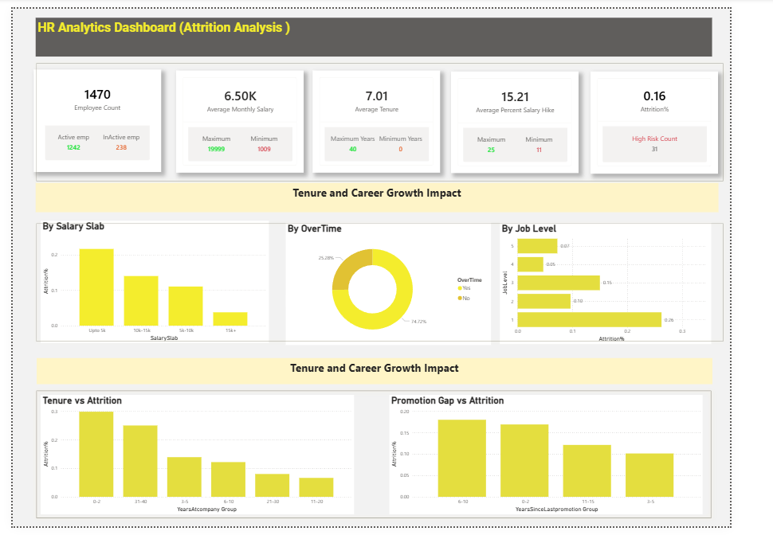
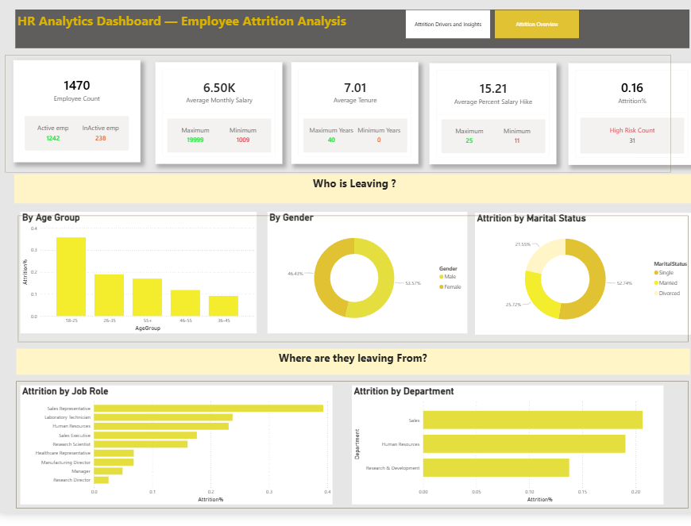

# HR Analytics Dashboard — Employee Attrition Analysis

##  Project Overview

This project analyzes employee attrition data to identify patterns related to employee turnover, salary, tenure, overtime, job level, job role, department, age group, and career growth.

The analysis was performed using SQL, Excel, and Power BI, with the final insights presented through an interactive HR analytics dashboard.

##  Objectives

- Analyze overall employee attrition.
- Identify employee groups with higher attrition rates.
- Understand the relationship between salary and attrition.
- Analyze attrition across job levels, job roles, and departments.
- Examine the impact of overtime on employee turnover.
- Study the relationship between tenure, promotion gaps, and attrition.
- Present key HR insights through an interactive Power BI dashboard.

##  Tools & Technologies

- **Power BI** — Dashboard development and data visualization
- **SQL / PostgreSQL** — Data analysis and querying
- **Excel** — Data preparation and analysis
- **CSV** — Source dataset

##  Dataset

The dataset contains employee-level HR information including:

- Employee demographics
- Department
- Job role
- Job level
- Monthly income
- Salary slab
- Overtime
- Years at company
- Years since last promotion
- Job satisfaction
- Attrition status
- Other employee-related attributes

##  Dashboard

### Attrition Overview

The dashboard provides an overview of:

- Employee count
- Average monthly salary
- Average tenure
- Average percentage salary hike
- Attrition rate
- Attrition by salary slab
- Attrition by overtime
- Attrition by job level
- Tenure vs attrition
- Promotion gap vs attrition



### Attrition Drivers & Insights

This section analyzes:

- Attrition by age group
- Attrition by gender
- Attrition by marital status
- Attrition by job role
- Attrition by department



##  Key Observations

- The overall dashboard shows an employee attrition rate of approximately 16%.
- Attrition varies across different salary slabs.
- Overtime status shows a noticeable difference in attrition distribution.
- Attrition differs across job levels and job roles.
- Employees in different tenure groups show different attrition patterns.
- Promotion history can be analyzed alongside attrition to identify career-growth-related patterns.
- Department and job-role analysis helps identify areas with comparatively higher attrition.

##  Business Value

The analysis can help HR teams:

- Identify employee groups with higher turnover.
- Monitor departments and roles with elevated attrition.
- Understand compensation-related attrition patterns.
- Examine the relationship between overtime and employee turnover.
- Identify potential career-growth and promotion-related patterns.
- Support data-driven employee retention strategies.

##  Project Files

```text
employee-attrition-analysis/
│
├── HR_Analytics.csv
├── attrition-overview.png
├── attrition-drivers-insights.png
└── README.md
